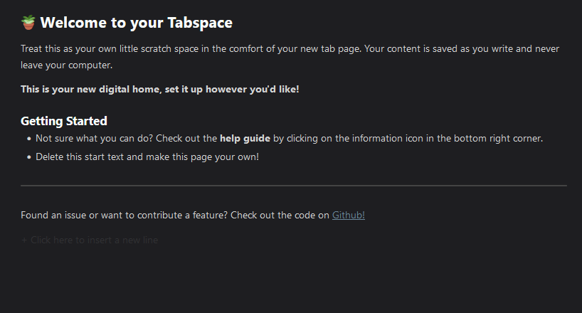

# 📝 Tab␣

A scratchspace for your new tab... *and* your sidebar! Tab Space is a beautiful new tab replacement that gives you your very own scratch space to help you stay organized and focused. It comes with a sidebar companion, customizable shortcut and toolbar button.

It features a prominent spatial visualization for all of your tasks that helps you prioritize what's important, auto-saving notes, rich text formatting and natural language due dates.

## 🖼 Screenshot

## 🌟 Demo

## ✨ Features

- Auto-saves to local storage
- Write in Markdown syntax
- Uses natural language to recognize and highlight due dates
- Darkmode

### 🦊 Only Available in Firefox

The Firefox version of the extension has had a few added features.

- Sidebar companion: open your TabSpace in Firefox's sidebar.
- New toolbar button: toggles the sidebar.
- Customizable keyboard shortcut: to toggle the sidebar.

## 👩‍💻 Development

- Clone the repository
- Install dependencies `npm i`
- Build `npm run build`
- Load the extension in the Chrome Extensions menu
  - Go to extensions > Enable developer mode (top right corner)
  - Click load unpacked, select the `build` folder

For more information, see the [documentation](https://developer.chrome.com/docs/extensions/mv3/getstarted/[official).

## 💜 Acknowledgements

This extension is a Firefox port of the Chrome extension with the same name. Thank you [Jacky](jzhao.xyz) for creating [Tab␣](https://github.com/jackyzha0/tabspace).

## © License

Source code in this repository is available under the [MIT License](LICENSE).
